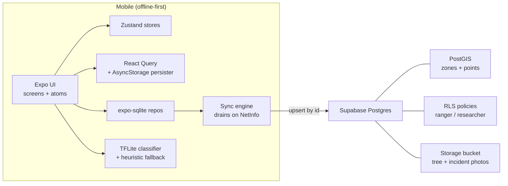

<div align="center">


# ForestSentry

**On-device forest monitoring for the rangers who actually walk the trails.**

[](https://github.com/aashir-athar/forest-sentry/stargazers)
[](https://github.com/aashir-athar/forest-sentry/network/members)
[](https://github.com/aashir-athar/forest-sentry/issues)
[](LICENSE)
[](https://github.com/aashir-athar/forest-sentry/commits/main)
[](https://docs.expo.dev/versions/v54.0.0/)
[](https://reactnative.dev/)
[](./mobile/tsconfig.json)
[](#)

</div>

ForestSentry is an offline-first React Native app for forest rangers and conservation researchers to tag trees, classify leaf health on-device with TensorFlow Lite, log illegal-logging incidents, and monitor protected zones — built with WWF Pakistan for remote forests like Nathia Gali where signal disappears and the case file still has to hold up. Open-source, Expo SDK 54, MIT licensed.

---

<div align="center">

<table>
<tr>
<td align="center" width="33%"><b>Field home (ranger)</b><br/><sub>Tap-first, edge-aligned actions, GPS lock at a glance.</sub></td>
<td align="center" width="33%"><b>Dataset (researcher)</b><br/><sub>Trend charts, CSV / GeoJSON export, multi-tree compare.</sub></td>
<td align="center" width="33%"><b>Leaf inspection</b><br/><sub>On-device TFLite verdict in under a second.</sub></td>
</tr>
</table>

</div>

---

## Table of contents

- [Why ForestSentry?](#why-forestsentry)
- [Features](#features)
- [Tech stack](#tech-stack)
- [Architecture](#architecture)
- [Design philosophy](#design-philosophy)
- [Getting started](#getting-started)
- [Scripts](#scripts)
- [Active-learning loop](#active-learning-loop)
- [Field data collection](#field-data-collection)
- [Roadmap](#roadmap)
- [Contributing](#contributing)
- [FAQ](#faq)
- [Acknowledgments](#acknowledgments)
- [License](#license)

---

## Why ForestSentry?

Conservation tooling has a credibility gap. The free apps lose data the moment a ranger walks under a canopy; the enterprise systems cost a forest department a year of payroll. ForestSentry sits in the middle: an open-source, mobile-first, **offline-first** field instrument that runs leaf-health AI locally, files prosecutable incident records with GPS and time, and ships its full dataset back to Supabase the moment signal returns. It is built on the locked Expo SDK 54 stack — `expo-router`, `react-native-reanimated`, `@shopify/flash-list`, `react-native-fast-tflite`, `expo-sqlite`, `@tanstack/react-query`, `zustand`, `tamagui` foundations — so any RN engineer can read the source on day one and contribute by Monday.

Long-tail keywords for the search engines (and the AI overviews): _react native expo sdk 54 offline-first starter, tensorflow lite leaf classifier mobile, plantvillage mobilenet react native, supabase email otp react native, expo otp code auth, conservation field app open source, WWF forest monitoring tool, postgis zone polygon supabase, expo router file-based navigation, react-native-fast-tflite example, jpeg-js pixel tensor tflite, on-device plant disease classifier 39-class, active learning loop react native, human-in-the-loop ML mobile, OTA TFLite model updates expo, MobileNetV2 transfer learning conservation, on-device AI without sentry without mmkv, async-storage persisted tanstack query._

---

## Features

- **Tag a tree in under 20 seconds** — GPS auto-captures, photo optional, species + girth + height in one form.
- **Classify a leaf on-device** — bundled PlantVillage MobileNet (39 plant-disease classes, folded into a 4-bucket verdict) running through `react-native-fast-tflite`; swap in your WWF-trained `.tflite` by replacing one file. A deterministic HSV heuristic fallback keeps the flow working on environments where the native module isn't linked yet.
- **Active-learning loop** — operators confirm or correct every model verdict; corrections feed a Supabase-backed training pipeline that retrains MobileNetV2 and ships improved models OTA without an app-store release.
- **Report an incident with severity** — observation / minor / serious / critical; photo + GPS + notes; queues offline.
- **Monitor protected zones with PostGIS** — draw polygons on the map; inside / outside detection in real time.
- **Project a tree's trajectory** — linear regression + EMA over inspection history, Skia-rendered chart.
- **Export your local dataset** — CSV for spreadsheets, GeoJSON for QGIS, one tap.
- **Switch role on the fly** — ranger or researcher; tabs and copy adapt.
- **High Visibility mode** — outdoor-sunlight tokens for direct-sun review.
- **System / light / dark theme** — persisted, animated, every component reads from tokens.
- **Skeleton loading everywhere** — never a spinner. The shimmer is the loading state.
- **Full a11y** — every interactive element has role + label + hint; `useReducedMotion` respected.

---

## Tech stack

| Category | Tool | Why |
|---|---|---|
| Framework | Expo SDK 54 | Locked, New Architecture default, fits the brief |
| Language | TypeScript (strict + noUncheckedIndexedAccess) | Senior-grade type safety |
| Navigation | expo-router | File-based, typed routes |
| Animations | react-native-reanimated 4 + worklets | UI-thread, 120 fps |
| Lists | @shopify/flash-list v2 | Faster, no estimatedItemSize needed |
| Images | expo-image | Memory-disk caching, contentFit |
| Maps | react-native-maps | Native MapView + polygons |
| AI inference | react-native-fast-tflite | TFLite on device, GPU-ready |
| Image decoding | jpeg-js | Pure-JS JPEG → RGB pixel tensor for TFLite inference |
| Active-learning | Custom (Supabase + expo-file-system) | model_versions registry, OTA model download, operator-corrected training samples |
| Training pipeline | TensorFlow 2.16 / Keras + tf.lite | MobileNetV2 transfer learning, int8 quantization, off-device (Colab) |
| Local DB | expo-sqlite | WAL mode, full repo layer |
| Persistence | @react-native-async-storage/async-storage | Section 0 — no MMKV |
| Data fetching | @tanstack/react-query + AsyncStorage persister | Offline-first cache |
| State | zustand | Lightweight, async persist |
| Forms | react-hook-form + zod | Type-safe, fast |
| Auth | @supabase/supabase-js (email OTP) | 6- or 8-digit code; works on any device, any email client, no deep links |
| Backend | Supabase (Postgres + PostGIS + Storage) | RLS-enforced, scriptable |
| Glass / blur | expo-glass-effect → expo-blur → flat | iOS 26 / iOS<26 / Android decision tree |
| Charts | @shopify/react-native-skia | Native canvas, smooth at any data size |
| Haptics | expo-haptics | Calibrated, never gratuitous |

---

## Architecture



```
forest-sentry/
├── mobile/                 # Expo SDK 54 app
│   ├── app/                # expo-router file-based routes
│   │   ├── (tabs)/         # Field, Map, Trees, Settings
│   │   ├── capture-tree.tsx
│   │   ├── capture-incident.tsx
│   │   ├── inspect.tsx
│   │   ├── tree-detail.tsx
│   │   ├── zone-edit.tsx
│   │   ├── sync-debug.tsx
│   │   ├── auth.tsx
│   │   └── onboarding.tsx
│   ├── src/
│   │   ├── components/     # atomic design system
│   │   ├── features/       # auth (email OTP), trees, inspections, incidents, zones, sync, db-cleanup
│   │   ├── hooks/          # cross-feature hooks
│   │   ├── stores/         # zustand
│   │   ├── api/            # supabase + react-query
│   │   ├── schemas/        # zod
│   │   ├── theme/          # tokens, provider
│   │   ├── lib/            # geo, projection, formatters, errorReporter, env
│   │   └── db/             # sqlite schema + repos
│   ├── assets/
│   │   ├── images/
│   │   ├── models/         # leaf-health.tflite (PlantVillage MobileNet, swappable for WWF model)
│   │   └── icon-prompts.md # Nano Banana Pro JSON prompts
│   ├── app.json
│   ├── eas.json
│   ├── tsconfig.json
│   └── package.json
└── backend/                # Supabase: SQL migrations + RLS + types
    ├── migrations/
    ├── policies/
    ├── storage/
    ├── functions/
    ├── types/
    └── seed.sql           # intentionally empty — every record is field-captured
```

---

## Design philosophy

- **Mission-driven, not playful.** Conservation tools need to feel like a field instrument, not a social app. Deep forest greens, bark neutrals, amber reserved for alerts.
- **Offline-first as a posture.** The device is the source of truth in a session; the cloud is the durable target. No screen blocks on the network.
- **Fitts's Law for gloved hands.** Primary actions (tag tree, report incident) live in the bottom thumb zone, edge-aligned, oversized.
- **Peak-end discipline.** Every capture ends with a satisfying confirmation — haptic + toast + immediate next view — because the moment of completion is what the operator remembers tomorrow.
- **Honest psychology.** Loss aversion only when real ("Filing offline is fine; the record is signed by your device, with GPS and time."). No fake countdowns, no fake urgency, no dark patterns.

---

## Getting started

### Prerequisites

- Node 20+ (or 22)
- Git
- Xcode 16 + iOS Simulator (for iOS) or Android Studio + Pixel emulator (for Android)
- A Supabase project (free tier is fine)

### Quick start

```sh
git clone https://github.com/aashir-athar/forest-sentry.git
cd forest-sentry/mobile
npm install
cp .env.example .env
# fill in EXPO_PUBLIC_SUPABASE_URL and EXPO_PUBLIC_SUPABASE_ANON_KEY
npx expo start
```

For Supabase setup, EAS builds, and store submission, see [`zero-to-deploy.md`](./zero-to-deploy.md).

---

## Scripts

All scripts run inside `mobile/`.

| Script | What it does |
|---|---|
| `npm run start` | Boot the Expo dev server |
| `npm run ios` | Open the iOS simulator |
| `npm run android` | Open the Android emulator |
| `npm run web` | Boot the web preview (mainly for inspection) |
| `npm run lint` | Run the Expo ESLint config |
| `npx tsc --noEmit` | Strict TypeScript pass |

---

## Active-learning loop

ForestSentry's classifier improves from real field captures over time, not from a frozen pre-shipped dataset. The full architecture lives in [`backend/training/README.md`](./backend/training/README.md); the smoke test below is the 9-step end-to-end check you can run today against the bundled placeholder model.

### Smoke test

After applying [`backend/migrations/0004_active_learning.sql`](./backend/migrations/0004_active_learning.sql) and creating the `training-photos` storage bucket per [`zero-to-deploy.md`](./zero-to-deploy.md), run this end-to-end check:

1. **Settings → Training contribution** → toggle **ON**.
2. Tag a tree (any species; GPS auto-captures).
3. Open **Inspect a leaf** → take a leaf photo.
4. Model predicts a verdict (likely "Healthy" with the bundled placeholder).
5. In the **Confirm verdict** card, tap a *different* pill — say "Stressed".
6. The override note appears: "Override: model said healthy, you filed stressed."
7. Tap **Log correction**.
8. Wait for the sync queue to drain (Settings → Sync debug shows 0 pending).
9. In Supabase **Table Editor → inspections**, your record carries:
   - `predicted_label = 'healthy'`
   - `corrected_label = 'stressed'`
   - `health_label = 'stressed'` (canonical filed verdict)
   - `model_version = 'bundled-placeholder'`
   - `contributed_to_training = true`

That row is now in `public.training_samples_leaf` — input for the training pipeline.

### Promoting a new model

After [`backend/training/train_leaf_health.py`](./backend/training/train_leaf_health.py) runs in Colab and inserts a `staging` row in `model_versions`, promote it:

```sql
select public.wwf_model_promote('leaf-health-v1.1.0');
```

Every device picks up the new `.tflite` on next launch (downloaded into `expo-file-system`). The bundled placeholder stays as the offline-first cold-install fallback.

To roll back:

```sql
select public.wwf_model_retire('leaf-health-v1.1.0');
select public.wwf_model_promote('leaf-health-v1.0.0');
```

---

## Field data collection

The headline brief deliverable that only the field team can do — the software is ready, the data isn't. Full rubric and bias-avoidance guidance in [`backend/training/FIELD_GUIDE.md`](./backend/training/FIELD_GUIDE.md). Summary:

### Target corpus

| Class | Minimum samples | Stretch goal |
|---|---|---|
| healthy | 200 | 500 |
| stressed | 200 | 500 |
| diseased | 200 | 500 |
| pest-damaged | 200 | 500 |

**~800 confirmed photos before the first credible production model**, roughly 30 patrol-hours of dedicated data collection (one ranger, 4–5 transects per visit, ~10 confirmed scans per transect).

### What each class looks like (Nathia Gali conifer focus)

| Class | Look for |
|---|---|
| **healthy** | Saturated green-to-blue needles, intact tips, no resin bleeding, full crown from below |
| **stressed** | Faded chlorosis (pale green, not brown), tip browning under 1 cm, reduced density on south aspects |
| **diseased** | Discrete necrotic lesions, resin canker bleeding, powdery mildew or rust coatings, witches' brooms |
| **pest-damaged** | Chewed needle margins, bark bore holes, visible insects, skeletonized needles, frass at trunk base |

### Workflow

1. Toggle **Settings → Training contribution = ON** at the start of every patrol (default is off — opt-in is non-negotiable).
2. Walk a transect crossing different aspects, age classes, and species — bias kills models.
3. At each stop: tag the tree, scan a leaf, **confirm or correct** the verdict, file.
4. ~10 confirmed scans per transect; more than that and ranger fatigue produces sloppy labels.
5. Return to signal at the end of the patrol — local records sync automatically.
6. When `select label, count(*) from public.training_samples_leaf group by label;` shows each class ≥ 200, you're ready to train.

### Biases to avoid

- **Aspect** — sample north and south aspects evenly; stress signals differ.
- **Time of day** — light changes everything; sample across morning / midday / late afternoon.
- **Species** — Blue pine, Deodar, Silver fir proportional to actual distribution, not whichever is closest to the trail.
- **Healthy bias** — force yourself to log diseased / pest cases when you find them, even if obvious.
- **Operator** — rotate rangers if possible; the training script can weight cross-operator agreement when retraining.

See [`backend/training/FIELD_GUIDE.md`](./backend/training/FIELD_GUIDE.md) for the full rubric, capture tips per class, and privacy guidance.

---

## Roadmap

- [x] V1 — Tree registry, on-device classifier, incident reporting, zone polygons, offline sync
- [x] V1 — Supabase backend with RLS, PostGIS, role helpers
- [x] V1 — CSV / GeoJSON export, trend projection, Sun-mode tokens
- [x] V1 — Bundled PlantVillage MobileNet (39-class, 4-bucket fold) + heuristic fallback
- [x] V1 — Active-learning loop: operator-correction UI, training opt-in, model_versions registry, OTA model downloads, Colab training script
- [ ] V1.1 — Logging-detection model trainer (`train_logging_detection.py`) once corpus exists
- [ ] V1.1 — Bluetooth caliper integration for girth auto-entry
- [ ] V1.1 — Vision Camera frame-processor TFLite (live leaf scan, no shutter)
- [ ] V1.2 — Multi-language UI (Urdu, Pashto)
- [ ] V2 — Predictive (time-series of tree health) trainer; needs 6+ months of real inspection data
- [ ] V2 — Anomaly (incident hotspot) trainer; needs months of real incident data
- [ ] V2 — WatermelonDB for very large datasets; cluster-rendering at scale
- [ ] V2 — Federated edge inference with on-device fine-tuning

---

## Contributing

First-time contributors are very welcome — there's a [`good first issue`](https://github.com/aashir-athar/forest-sentry/labels/good%20first%20issue) label specifically for you. The codebase is intentionally readable, and the design system gives you a head start on any screen.

- **Branch naming:** `feat/<thing>`, `fix/<thing>`, `chore/<thing>`, optionally date-stamped.
- **Commits:** [Conventional Commits](https://www.conventionalcommits.org/) (`feat:`, `fix:`, `chore:`, `docs:`).
- **PRs:** open against `main`, describe what changed and why, link the issue.

If you're new to React Native, start with a copy fix or an empty-state polish. If you're a botanist or forest scientist, the highest-impact contribution is a real `.tflite` leaf-health model — see `mobile/assets/models/README.md`.

<div align="center">

<a href="https://github.com/aashir-athar/forest-sentry/graphs/contributors">
  
</a>

</div>

<div align="center">

<a href="https://star-history.com/#aashir-athar/forest-sentry&Date">
  
</a>

</div>

---

## FAQ

<details>
<summary><b>How does on-device tree-health AI work?</b></summary>

A captured leaf photo is resized to the model's declared input edge (224×224 for the bundled PlantVillage MobileNet), decoded JPEG → RGB pixel tensor via `jpeg-js`, then passed to `react-native-fast-tflite` with a dtype-aware buffer (uint8 for quantized models, float32 for float models). The model emits a 39-class probability vector over PlantVillage species/disease pairs, which the app folds into a 4-bucket verdict — healthy, stressed, diseased, or pest-damaged — via a lookup table in [`mobile/src/features/inspections/labels.ts`](mobile/src/features/inspections/labels.ts). The result includes both the bucket label and the top fine-grained class (e.g. "Tomato — late blight"), so a researcher can see species-level detail while a ranger sees a clean four-way verdict.

If the native module isn't linked (Expo Go, or before a dev client is built) the classifier silently falls back to a deterministic HSV color-distribution heuristic that produces the same `ClassifyResult` shape — the rest of the app is unchanged.
</details>

<details>
<summary><b>Does ForestSentry work offline?</b></summary>

Yes. Every screen reads from a local SQLite database, photos live in `expo-file-system`, and writes queue locally with a stable ID. When `NetInfo` reports connectivity, the sync engine drains the queue to Supabase in dependency order (zones → trees → inspections → incidents) using idempotent upserts.
</details>

<details>
<summary><b>What does the Supabase backend store?</b></summary>

Postgres tables for zones, trees, inspections, incidents, and ranger-to-zone assignments. PostGIS columns are computed automatically from lat/lng or the boundary JSON. Row-level security gates reads and writes by role (`ranger` / `researcher`). Photos sit in two Storage buckets (`tree-photos`, `incident-photos`) keyed by record ID. The database ships empty — no seed data, no demo zones — so every record in your project is genuine field work.
</details>

<details>
<summary><b>How does sign-in work?</b></summary>

Email OTP. The user types their email, Supabase sends a 6- or 8-digit code (configurable in the Dashboard), and the app verifies the code in-place — no magic-link URL, no deep linking, no email-client previews burning the token. The schema accepts both lengths so the same client works whichever you choose. Roles (`ranger` / `researcher`) are set on the user's Supabase metadata by a WWF admin via the `wwf_admin_promote` / `wwf_admin_demote` helpers and enforced server-side by RLS — the in-app role switcher in Settings is a view-mode toggle, not a permissions escalator.
</details>

<details>
<summary><b>Can I swap in a WWF-trained classifier?</b></summary>

Yes. The app ships with a PlantVillage MobileNet placeholder so the pipeline works out of the box; to use a custom WWF-trained model, overwrite `mobile/assets/models/leaf-health.tflite` with your `.tflite` file, then update the `modelClasses` array and the `BUCKETS` table in `mobile/src/features/inspections/labels.ts` to match your model's class order and bucket assignments. No other code changes are required — the classifier reads the model's declared input shape and dtype at load time. The full swap procedure is in [`zero-to-deploy.md`](./zero-to-deploy.md).

Or — and this is the recommended path — use the active-learning loop instead of a manual swap. Operators correct verdicts in the field, the corrections feed `public.training_samples_leaf`, the training script in `backend/training/train_leaf_health.py` retrains MobileNetV2 against the cumulative corpus, uploads the new `.tflite` to Supabase Storage, and registers a `staging` row in `public.model_versions`. A researcher promotes it to `production` via `select public.wwf_model_promote('leaf-health-v1.1.0')` and every device downloads the new model on next launch — no app-store release needed.
</details>

<details>
<summary><b>How does the active-learning loop work?</b></summary>

End-to-end, fully real-data:

1. **Operator captures a leaf photo** in the inspect screen. The on-device classifier predicts a verdict (healthy / stressed / diseased / pest) with a confidence score.
2. **Operator confirms or corrects** the verdict using the pill row. The diff is the training signal.
3. **Local SQLite records both** `predicted_label` and (when overridden) `corrected_label`, plus the model version that made the prediction. If the operator has enabled training contribution in Settings, the record's `contributed_to_training` flag is set.
4. **Sync engine** pushes the record to Supabase Postgres on the next connection. The `training_samples_leaf` view exposes a clean training corpus to researcher-role users.
5. **Training pipeline** (Colab notebook in [`backend/training/`](./backend/training/)) reads the view, downloads photos from Storage, fine-tunes MobileNetV2, quantizes to int8 TFLite, uploads, and inserts a `model_versions` row with `status='staging'`.
6. **Researcher promotes** the model with `wwf_model_promote('<tag>')`. The previous production model is automatically retired.
7. **Mobile app polls** `model_versions` on every launch via [`modelRegistry.ts`](./mobile/src/features/ml/modelRegistry.ts), downloads the new `.tflite` + labels JSON into `expo-file-system`, and the classifier reads from the file-system path on next inference. The bundled placeholder stays as the cold-install / offline-first fallback.

No mock data ever enters the loop. The training corpus is exactly what operators captured in the field.
</details>

<details>
<summary><b>Who is this for?</b></summary>

Forest rangers and conservation researchers — primarily WWF Pakistan in the Khyber Pakhtunkhwa pilot, but the architecture is generic. Any NGO or forest department running mobile-first field workflows can fork it.
</details>

<details>
<summary><b>Is this production-ready?</b></summary>

The mobile app compiles cleanly under strict TypeScript on Expo SDK 54, ships a complete design system, offline sync, a real bundled TFLite classifier (PlantVillage MobileNet, 244 KB), and a hardened Supabase backend with RLS. It is opinionated and small enough to read end-to-end in an afternoon. For a WWF pilot the next steps are: swap the placeholder PlantVillage model for the WWF-trained classifier, populate the Supabase project, build a dev client via EAS, and run a one-week field test.
</details>

---

## Acknowledgments

- [Expo](https://expo.dev) — for SDK 54 and the New Architecture default.
- [Shopify](https://shopify.github.io/flash-list/) — FlashList v2.
- [Software Mansion](https://github.com/software-mansion/react-native-reanimated) — Reanimated.
- [Marc Rousavy](https://github.com/mrousavy/react-native-fast-tflite) — react-native-fast-tflite.
- [jpeg-js](https://github.com/jpeg-js/jpeg-js) — pure-JS JPEG decoder powering the on-device pixel-tensor path.
- [PlantVillage dataset](https://plantvillage.psu.edu/) — the open plant-disease corpus the bundled classifier was trained against.
- [akshayrana30/plant-disease-detection](https://github.com/akshayrana30/plant-disease-detection) — the public PlantVillage MobileNet TFLite + labels.txt that ship as the V1 placeholder model.
- [Supabase](https://supabase.com) — the cloud foundation.
- [WWF Pakistan](https://www.wwfpak.org/) — the mission anchor.

---

## License

MIT — see [`LICENSE`](./LICENSE).

---

<div align="center">

Built by **[Aashir Athar](https://github.com/aashir-athar)**

<a href="https://github.com/aashir-athar"></a>
<a href="https://x.com/aashir_athar"></a>
<a href="https://www.linkedin.com/in/aashir-athar/"></a>

</div>

<!--
GitHub repo settings to apply manually (one-time):
  About blurb: "Offline-first React Native app for forest rangers and conservation researchers — on-device leaf-health AI, GPS tree registry, illegal-logging incident reporting, PostGIS zone monitoring. Expo SDK 54, TypeScript strict, MIT. Built with WWF Pakistan."
  Topics: react-native, expo, expo-sdk-54, typescript, mobile-app, offline-first, tensorflow-lite, plantvillage, supabase, postgis, email-otp, conservation, forestry, wwf, environment, geospatial, leaf-classifier, ai-on-device
  Homepage: https://github.com/aashir-athar/forest-sentry
-->
